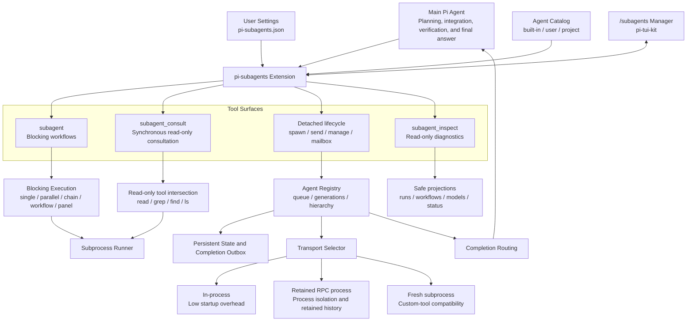
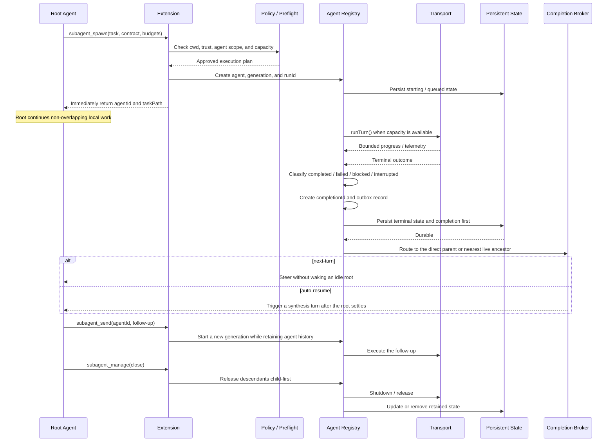
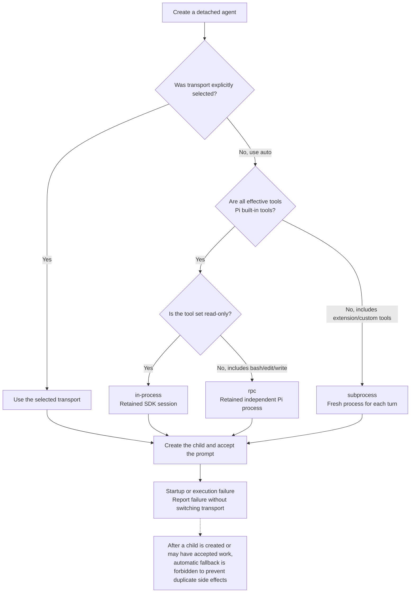
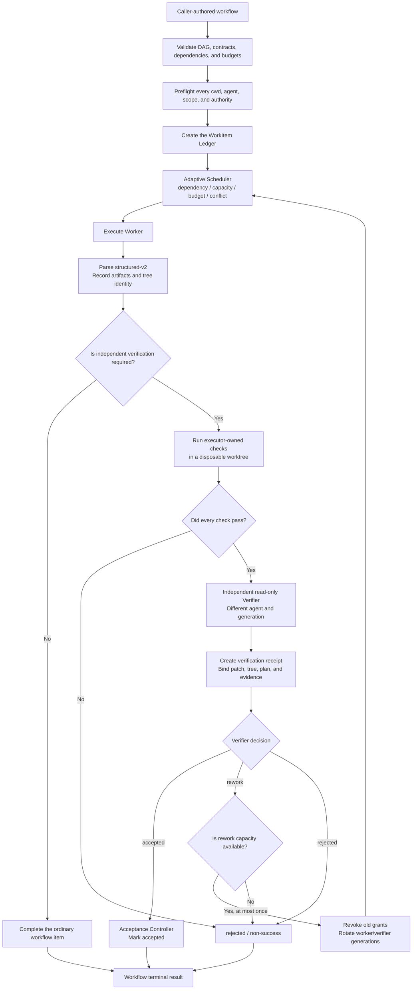

# pi-subagents Architecture Diagrams

These diagrams describe the main `pi-subagents` components, detached-agent lifecycle, transport selection, and verified workflow.

## Overall architecture

## Detached-agent execution and completion delivery

The system persists each completion before notifying its parent so that a process interruption does not permanently lose the result.

## Automatic transport selection

Read-only classification is based on effective tool permissions rather than promises written in the task prompt.

## Verified workflow and acceptance barrier

A worker's own claim that verification passed cannot move acceptance from `pending` to `accepted`.

Only executor-owned checks, an independent verifier, and the acceptance controller can complete acceptance.
